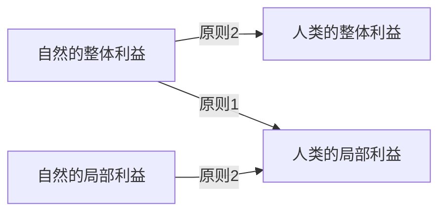

#  工程活动中的环境伦理

##  4.1 工程活动中环境伦理观念的确立

###  4.1.1 工业化过程中保护环境的两种思路

1. **资源保护主义**：主张“科学的管理，明智的利用”，保护的目的是为了更好地开发利用。这是一种**人类中心主义**的资源管理方式，这种功利主义自然保护思想在进入20世纪后一直是资源保护运动的基本原则。
2. **自然保护主义**：保护自然本身的利益，保护的目的是为了自然自身。这是一种**非人类中心主义**的资源管理方式。

###  4.1.2 工程环境伦理的基本思想

**人类中心主义**的核心观点：

* 把人看成是自然界唯一具有内在价值的事物，必然地构成一切价值的尺度，自然界的其他事物只有工具价值。
* 在人与自然的伦理关系中，道德原则的确立应该首要地满足人的利益，工程活动的出发点和目的只能且应当是人的利益。
* 人对自然并不存在直接的道德义务，如果说人对自然有义务，也只是对人的义务的间接反映。

**非人类中心主义**的核心观点：

* 人类不是一切价值的源泉，因而人类的利益不能成为衡量一切事物的尺度。
* 人类只是自然的一部分，需要将自己纳入更大整体之中才能客观地认识自己存在的意义和价值。
* 道德关怀的范围应该从人类拓展到非人类的生命或自然存在物上。

非人类中心主义的基本思想：

1. **动物解放论**、**动物权利论**：把道德关怀的对象扩大到有感觉的生命（即动物）上。
2. **生物中心主义**：把道德关怀的对象范围扩大到一切有生命的存在，倡导一种尊重生命的态度。
3. **生态中心主义**（**生态整体主义**）：整个自然界及其所有事物和生态过程都应成为道德关怀的对象。

###  4.1.3 工程环境伦理的核心问题

自然界的价值有两大类：**工具价值**和**内在价值**。工具价值指自然界对人的有用性。内在价值为自然界及其事物所固有，与人存在与否无关。内在价值是工具价值的依据，如果我们承认自然事物和自然界拥有内在价值，那么我们与自然事物就有了道德关系，也就承认了自然界拥有与内在价值相关的权利。

工程环境伦理的核心问题：

* 是否承认自然界及其事物具有客观的内在价值？
* 是否承认自然界拥有与内在价值相关的权利？

自然界及其事物具有客观的内在价值和权利？

##  4.2 工程活动中的环境价值与伦理原则

###  4.2.1 工程活动中的环境影响

工程建设对环境产生直接或间接影响，包括占用土地资源、水土流失、生态失衡、气候异常，以及废气、废水、固体废弃物和噪声、尘埃等。最常见的有：

1. 消耗大量的能源和天然资源
2. 产生各种建筑垃圾、废弃物、化学品或危险品污染环境
3. 工地产生的污水造成水污染
4. 噪声和振动的影响
5. 排出有害气体或粉尘污染空气，威胁人们的健康

###  4.2.2 工程活动中的环境道德要求

工程建设与环境保护的关系：密不可分。

工程活动负载着人类价值，这就使工程活动本身具有了道德上的善恶之分。

一个好的工程可以实现工程建设和环境保护的良好循环，关键在于工程建设过程中体现环境伦理意识，以良好的环境伦理意识促进工程建设的可持续发展，在工程建设中把自然的需求和人的需求结合起来综合考虑，审慎开发利用自然环境。

###  4.2.3 工程活动中的环境价值观

工程建设与生态环境的关系：人类的工程行为是一种纯粹的“造物”活动，常常会超过自然的阈值而造成不可逆的环境损害。

工程理念是工程活动的出发点和归宿，是工程活动的灵魂。工程活动的最高境界应该是实现并促进人与自然的协同发展。

人与自然协同发展的环境价值观：人类不应只把从自然界获取物质财富作为至上的道德价值目标，所有决策只能合理地利用自然资源，保护自然和生态平衡。

绿色工程环境价值观强调了人与自然的和谐相处，力图把经济效益和环境保护结合起来，用兼顾环境、社会和经济等方面的多价值标准来评价工程，实现各种利益最大程度的协调，统筹兼顾，达到各方利益最大化。

###  4.2.4 工程活动中的环境伦理原则

工程建设与自然环境的关系：工程活动对自然环境具有道德义务。

工程活动中的环境伦理原则：

1. **尊重原则**：一种行为是否正确，取决于它是否体现了尊重自然这一根本性的道德态度。

   人对自然环境的尊重态度取决于我们如何理解自然环境及其与人的关系。尊重原则体现了我们对自然环境的首先态度，因而成为我们行动的首要原则。

2. **整体性原则**：一种行为是否正确，取决于它是否遵从了环境利益与人类利益相协调，而非仅仅依据人的意愿和需要这一立场。

   这一原则旨在说明，人与环境是一个相互依赖的整体。它要求人类在确定自然资源的开发利用时必须充分考虑自然环境的整体状况，尤其是生态利益。

3. **不损害原则**：一种行为，如果以严重损害自然环境的健康为代价，那么它就是错误的。
   不损害原则隐含着这样一种义务：不伤害自然环境中一切拥有自身善的事物。如果自然拥有内在价值，它就拥有自身的善，它就有利益诉求，这种利益诉求要求人们在工程活动中不应严重损害向然的正常功能。这里的"严重损害"是指对自然环境造成的不可逆转或不 可修复的损害。不损害原则充分考虑到了正常的工程活动对自然生态造成的影响，但这种影响应当是可以弥补和修复的。

4. **补偿原则**：一种行为，当它对自然环境造成了损害，那么责任人必须作出必要的补偿，以恢复自然环境的健康状态。

   这一原则要求人们履行一种义务：当自然生态系统受到损害的时候，责任人必须重新恢复自然生态平衡。所有的补偿性义务都有一个共同的特征：如果他的做法打破了自己与环境之间正常的平衡，那么，就须为自己的错误行为负责，并承担由此带来的补偿义务。

当人的利益与自然的利益冲突时，遵循2个原则：

1. **整体利益高于局部利益原则**：人类一切活动都应服从自然生态系统的根本需要。
2. **需要性原则**：在权衡人与自然利益的优先秩序上应遵循生存需要高于基本需要、基本需要高于非基本需要的原则。

一种极端情况：人类与自然环境同时面临生存需要且无任何其他选择时，人的利益才具有优先性。如：河流生态用水与人饮用水的冲突。

只要有了尊重自然的基本态度，并按上述原则行动，冲突很难出现，罕见的极端情况在出现前就得到化解。

##  4.3 工程师的环境伦理

###  4.3.1 工程共同体的环境伦理责任

工程共同体的环境伦理主要指工程过程应切实考虑自然生态及社会对其生产活动的承受性，应考虑其行为是否会造成公害，是否会导致环境污染，是否浪费了自然资源，要求企业公正地对待自然，限制企业对自然资源的过度开发，最大限度地保持自然界的生态平衡。

**工程决策**是避免和减少生态破坏的根本性环节。**工程设计**是工程活动的起始阶段，起到举足轻重的作用，决定着工程可能产生的影响。

###  4.3.2 工程师的环境伦理责任

工程活动对环境的影响，要求工程技术人员在工程的设计、实施中不仅要对工程本身、对雇主利益、对公众利益，还要对自然的环境负责，使工程技术活动向有利于环境保护的方面发展。工程师的环境伦理责任包含了维护人类健康，使人免受环境污染和生态破坏带来的痛苦和不便；维护自然生态环境不遭破坏，避免其他物种承受其破坏带来的影响。

###  4.3.3 工程师的环境伦理规范

工程师的环境伦理规范就是针对工程师在面临环境责任时可以使用的行动指南，表现为：

1. 尽你最大的能力、勇气、热情和奉献精神，取得出众的技术成就，从而有助于增进人 类健康和提供舒适的环境（不论在户外还是户内）。
2. 努力使用尽可能少的原材料与能源，并只产生最少的废物和任何其他污染，来达到你的工作目标。
3. 特别要讨论你的方案和行动所产生的后果，不论是直接的或间接的、短期的或长期的，对人们健康、社会公平和当地价值系统产生的影响。
4. 充分研究可能受到影响的环境，评价所有的生态系统（包括都市和自然的）可能受到的静态的、动态的和审美上的影响以及对相关的社会经济系统的影响，并选出有利于环境和可持续发展的最佳方案。
5. 增进对需要恢复环境的行动的透彻理解，如有可能，改善可能遭到干扰的环境，并将它们写入你的方案中。
6. 拒绝任何牵涉不公平地破坏居住环境和自然的委托，并通过协商取得最佳的可能的社会与政治解决办法。
7. 意识到：生态系统的相互依赖性、物种多样性的保持、资源的恢复及其彼此间的和谐协调形成了我们持续生存的基础，这一基础的各个部分都有可持续性的阈值，那是不容许超越的。